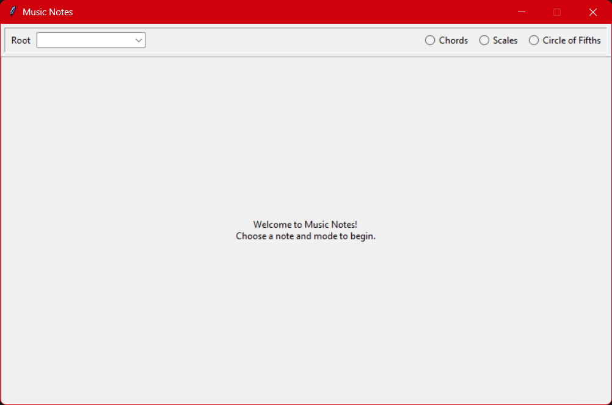
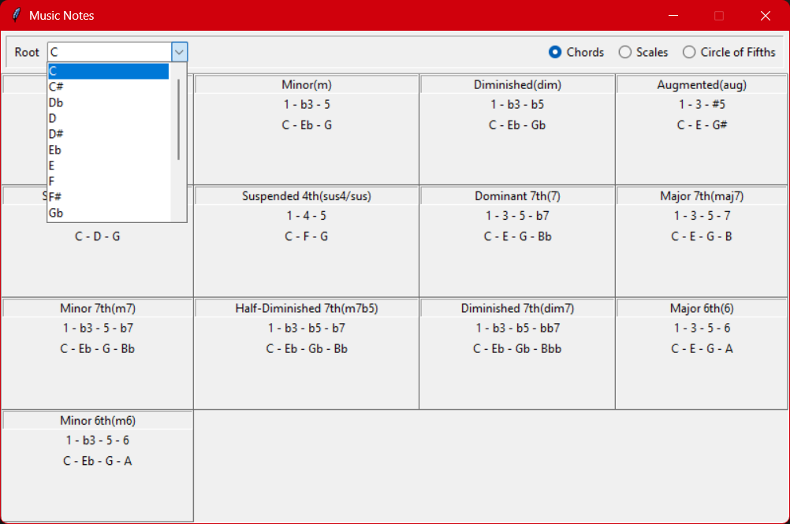

Music Notes
--

## Description

Music Notes is a simple application that displays the notes of common chords and scales for a selected root note, and includes a Circle of Fifths reference.

## Features

- Generate notes for common chords
- Generate notes for common scales
- Display the Circle of Fifths
- Theoretically correct note spelling (enharmonic-aware)

## Prerequisites

- Python >= 3.12
-  Tkinter (included with most standard Python installations)

> **Note:** On some Linux distributions, Tkinter may need to be installed separately.

## Installation

#### 1. Clone this repository

```
git clone https://github.com/KampososDimitris/Music-Notes.git

# Navigate to root directory
cd Music-Notes
```

#### 2. Create and activate venv

```
# Create venv
python -m venv venv

# Activate venv in cmd
.\venv\Scripts\activate

# Activate venv in bash
source venv/bin/activate
```

> If *python* doesn't work, try *py* or *python3*.

#### 3. Install dependencies

```
python -m pip install .
```

#### 4. Run the application

```
python src/main.py
```

#### 5. (Optional) Create .exe file using pyinstaller

```
pyinstaller --noconsole --add-data "assets;assets" src/main.py 
```

The .exe file will be located inside the **dist** directory.
For more details about pyinstaller, visit the official [page](https://pyinstaller.org/en/stable/).

> Note: This command is intended for Windows. On Linux/macOS, PyInstaller uses : instead of ; in --add-data.


## Usage

Once the application is running correctly, the user is greeted with a welcome screen.



From here, they can select a root note from the dropdown and an option from 'Chords', 'Scales' and 'Circle of Fifths'.



The user can then select different root notes and browse the available chords, scales, and Circle of Fifths.